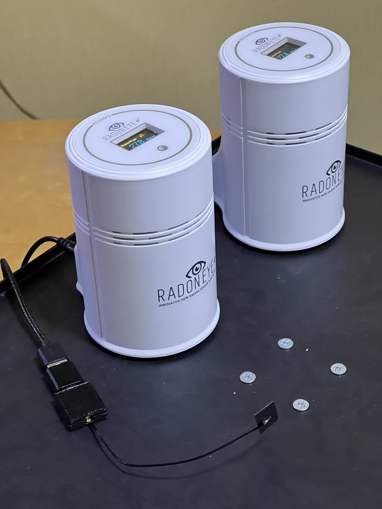

# RadonEye Plus2 → ESP32 → Home Assistant / Web UI

> 🇬🇧 English version: [README.en.md](README.en.md)



*Слева — RadonEye Plus2 (RD200P2) с OLED-дисплеями.
Внизу — ESP32-плата в корпусе, напечатанном на 3Д принтере, с внешней PCB-антенной на U.FL/IPEX-кабеле:
выносная антенна даёт стабильный RSSI прибор↔шлюз даже через железобетонную стену.*

Готовая ESPHome-прошивка, которая превращает копеечную ESP32-плату в **постоянный
BLE-шлюз** между радон-детектором **RadonEye Plus2 (RD200PLUS)** и вашим домом.
Прибор перестаёт зависеть от телефона — пока ESP32 стоит у розетки, данные текут
24/7 без приложения FTLAB/Ecosense и без облака.

```
RadonEye Plus2 ─BLE Notify─► ESP32 ─Web UI v3─► браузер
   (RD200PLUS)                  │
                                ├─► ESPHome API ─► Home Assistant
                                │
                                └─► Народмон (инфраструктура есть, ВЫКЛ по умолчанию)
```

Документация скилла:

- [`SKILL.md`](SKILL.md) — полная база знаний
- [`INSTALL.md`](INSTALL.md) — пошаговая установка + 12 troubleshooting-кейсов
- [`KNOWN_ISSUES.md`](KNOWN_ISSUES.md) — матрица совместимости плат + реестр инцидентов
- [`firmware/CHANGELOG.md`](firmware/CHANGELOG.md) — история версий прошивок
- [`references/plus2_protocol.md`](references/plus2_protocol.md) — полная BT-расшифровка протокола

---

## Какая прошивка для какой платы

В скилле — **две прошивки** на одной кодовой базе, по подпапке на тип платы.
Различия: целевой ESP32-модуль, BLE-стек, количество одновременных приборов.

| Прошивка | Целевая плата | Что внутри | Когда выбирать |
|---|---|---|---|
| **[`firmware/xiao-esp32-c3/radon_ha_gateway_c3.yaml`](firmware/xiao-esp32-c3/radon_ha_gateway_c3.yaml)** *(актуальная, v2.1-c3, 2026-06-17)* | **Seeed Studio XIAO ESP32-C3** (`board: seeed_xiao_esp32c3`, variant=`esp32c3`, framework=arduino) | BLE-клиент к 1×RadonEye Plus2, Web Server v3 + Basic Auth + sorting_groups (5 групп: Sensors / BLE / Actions / Народмон / Diag), ESPHome API encryption, watchdog WiFi, Народмон-инфраструктура (switch `ALWAYS_OFF`) | Готовый production-шлюз для **одного** RadonEye Plus2, минимальная плата (~$5), USB-C нативный |
| [`firmware/esp32-classic/radon_ha_gateway.yaml`](firmware/esp32-classic/radon_ha_gateway.yaml) *(v2.0, 2026-06-15)* | **ESP32-DevKitC v4** WROOM-32 (`board: esp32dev`, framework=arduino) | Базовый шлюз под классическую DevKitC, BLE-клиент к 1×RadonEye, Web UI + ESPHome API | Когда плата DevKitC уже куплена, либо нужен micro-USB вместо USB-C |

Обе прошивки слушают тот же протокол RadonEye Plus2 (`Service 00001523-…`).
Полная матрица совместимости поддерживаемых / непроверенных / несовместимых плат —
в [`KNOWN_ISSUES.md`](KNOWN_ISSUES.md) §1.

---

## Что эта прошивка решает

- Приложение FTLAB/Ecosense — только Android/iOS, держит данные в телефоне.
- Готовая HA-интеграция существует, но требует HA + отдельный Bluetooth-proxy.
- Эта прошивка превращает ESP32 в **самостоятельный 24/7-шлюз без облака**:
  BLE → парсинг → Web UI + ESPHome API + (опц.) Народмон.

---

## Быстрый старт (XIAO ESP32-C3, ~15 минут)

Полный гид по установке с troubleshooting — в [`INSTALL.md`](INSTALL.md).
Краткая версия:

### 1. Подготовить secrets

```powershell
git clone https://github.com/VibeEngineering-LLC/radoneye-esp32.git
cd radoneye-esp32\firmware\
Copy-Item secrets.example.yaml secrets.yaml
```

Открыть `secrets.yaml` и заполнить:
- `wifi_ssid` / `wifi_password` — домашняя Wi-Fi 2.4 GHz.
- `ap_password` — пароль captive-portal AP «radon-gw Fallback» (≥8 символов).
- `api_encryption_key` — `python -c "import secrets,base64; print(base64.b64encode(secrets.token_bytes(32)).decode())"`.
- `ota_password` — длинный пароль для OTA (используется и как Web UI Basic Auth password; username = `radon` inline в YAML).
- `radon1_mac` — **можно оставить заглушкой `AA:BB:CC:DD:EE:FF`**, MAC прибора задаётся через Web UI после первой загрузки.

### 2. Скомпилировать и прошить

```powershell
# Подставь свой путь к esphome.exe (типовое расположение в Windows):
$esp = "$env:LOCALAPPDATA\Programs\Python\Python312\Scripts\esphome.exe"
$env:PYTHONIOENCODING = "utf-8"; $env:PYTHONUTF8 = "1"
cd claude-skills\radoneye-esp32\firmware\
& $esp compile xiao-esp32-c3/radon_ha_gateway_c3.yaml
& $esp upload  xiao-esp32-c3/radon_ha_gateway_c3.yaml --device COM<N>
```

Найти COM-порт:
```powershell
Get-CimInstance Win32_PnPEntity | Where-Object { $_.Name -match 'CH340|CP210|FTDI|USB Serial' }
```

### 3. Первый запуск → captive portal → WiFi

Если WiFi не настроен — ESP поднимает AP **«radon-gw Fallback»** с паролем из
`ap_password`. С телефона подключиться к этому AP → открыть `http://192.168.4.1/` →
выбрать домашнюю сеть → ввести пароль → **Save**. ESP перезагрузится и подключится.

### 4. Web UI и MAC-привязка

В обычной сети: `http://radon-gw.local/` (логин `radon`, пароль = `ota_password` из `secrets.yaml`).

В Web UI:
- Группа **«Поиск BLE»** → «Запустить скан 30 с» → найти прибор по имени `FR:PD…`,
  скопировать MAC.
- Вставить в **«MAC Radon 1»** → нажать «Применить MAC и перезагрузить».
- После рестарта в группе **«Sensors»** должны побежать радон/температура/Peak/Count.

### 5. Подключение к Home Assistant

В HA → Settings → Devices & Services → **Add Integration** → ESPHome →
host `radon-gw.local` (или IP), encryption key — тот, что в `secrets.yaml`.

### Если что-то пошло не так

См. [`INSTALL.md`](INSTALL.md) §11 (12 troubleshooting-кейсов) и
[`KNOWN_ISSUES.md`](KNOWN_ISSUES.md) (матрица совместимости + 7 инцидентов).

---

## Полная расшифровка BLE-протокола RadonEye Plus2

> Все цифры ниже — результат **live-реверса 2026-06-15** (прямое чтение через
> Bluetooth ПК + HCI-snoop трасса официального приложения RadonEye+² для Android).
> Подробности и сырые кадры — в [`references/plus2_protocol.md`](references/plus2_protocol.md).

### Идентификация прибора в эфире

| Параметр | Значение |
|---|---|
| Модель | **RD200PLUS** (семейство «Plus2») |
| advertising local_name | `FR:PD<serial>` (префикс поколения `FR:PD`, цифры — серийник) |
| Тип PDU | ADV_IND |
| Интервал adv | ≈ 1 с |
| Service UUID в adv | `00001523-1212-efde-1523-785feabcd123` (Nordic-base) |
| MTU | 23 (default, не запрашивает увеличение) |
| Pairing / bonding | НЕ требуется |
| Single-central | один host подключён — другие получают refuse (выключить FTLAB-app перед стартом шлюза) |

### GATT-карта

```
SERVICE  h=0x0001  1800  Generic Access Profile
SERVICE  h=0x0008  1801  Generic Attribute Profile
SERVICE  h=0x0009  00001523-1212-efde-1523-785feabcd123   (Nordic-base, "LED Button Service")
  CHAR   h=0x000a  00001524-...   [read,write]   <- WRITE (команды/опкоды), VALUE-handle 0x000b
  CHAR   h=0x000c  00001525-...   [read,notify]  <- NOTIFY-1 (ответы),       VALUE-handle 0x000d
    DESC h=0x000e  2902  CCCD
  CHAR   h=0x000f  00001526-...   [read,notify]  <- NOTIFY-2 (история),      VALUE-handle 0x0010
    DESC h=0x0011  2902  CCCD
SERVICE  h=0x0012  180a  Device Information
  CHAR   h=0x0013  2a29  [read]  Manufacturer Name String
```

ATT работает по **value-handle (declaration + 1)**: WRITE = `0x000b`, NOTIFY-1 = `0x000d`,
NOTIFY-2 = `0x0010`.

### Whitelist опкодов (HARD — НЕ НАРУШАТЬ)

Разрешено писать только в **value-handle 0x000b**:

```
{0x10, 0x50, 0x51, 0x53, 0x54, 0x56, 0x60, 0x61, 0xA4, 0xA6, 0xA8, 0xAF, 0xE8, 0xE9}
```

> ⚠️ **DFU-RISK.** Перебор опкодов **в диапазоне `0xA0..0xCF` вне whitelist**
> переводит прибор в DFU mode. Зафиксировано инцидентом 2026-06-07. Восстановление —
> только физическая разрядка (вынуть батарейки ~30 с).
>
> 🛑 **`0x53` — config-WRITE.** Опкод входит в whitelist в смысле «прибор его
> распознаёт», но голый `0x53` (без валидного payload) **обнуляет конфиг
> прибора**: дисплей переключается Bq/m³ → pCi/L, порог тревоги обнуляется.
> Восстановление — ТОЛЬКО вручную через приложение RadonEye.
>
> **Опрос шлюзом = ТОЛЬКО `{0x50, 0x51}`.** Любой иной опкод считать потенциально
> пишущим и не слать без точного знания payload (или без трассы официального
> приложения, подтверждающей безопасность).

### Опкод 0x50 — мгновенный радон (декодирован live, 6/6)

**Запрос:** записать 20-байтовую команду `50 11 00 … 00` в WRITE-handle `0x000b`.
**Ответ:** notify на NOTIFY-1 (`0x000d`), **20 байт**.

Сырой пример (live, радон ≈ 18 Bq/m³):
```
50 10 12 00 00 00 00 00 00 00 00 00 16 00 01 00 02 00 1f 16
```

| Offset | Поле | Тип | Смысл |
|---|---|---|---|
| `[0]` | opcode echo | u8 | `0x50` |
| `[1]` | длина payload | u8 | `0x10` = 16 |
| `[2:4]` | **Радон current** | **uint16 LE, Bq/m³** | 18 в примере (= 0.486 pCi/L) |
| `[4:6]` | резерв | uint16 LE | всегда 0 (НЕ day-avg) |
| `[6:8]` | резерв | uint16 LE | всегда 0 (НЕ month-avg) |
| `[8:12]` | резерв / нули | — | 0 |
| `[12:14]` | **Peak (макс радон)** | uint16 LE, Bq/m³ | подтверждено дисплеем прибора |
| `[14:16]` | **Count (номер замера)** | uint16 LE | растёт 1→2→3 в окне |
| `[16:18]` | вторичный счётчик | uint16 LE | назначение уточняется |
| `[18:20]` | часы mm:ss (кэш) | 2×u8 | значение с момента последнего `0x51` (не live) |

**Конверсия единиц:** `pCi/L = Бк/м³ ÷ 37` (точно). Прибор отдаёт **Bq/m³**.

### Опкод 0x51 — статус/uptime/live-часы

**Запрос:** `51 11 00 … 00` в `0x000b`. **Ответ:** notify на `0x000d`, 20 байт.

Сырой пример:
```
51 12 02 00 5c 00 00 00 fc 0a 08 00 aa 19 1a 06 0f 01 1f 16
```

| Offset | Поле | Тип | Смысл |
|---|---|---|---|
| `[0]` | opcode echo | u8 | `0x51` |
| `[1]` | длина payload | u8 | `0x12` = 18 |
| `[2:4]` | статус | uint16 LE | константа `0x0002` |
| `[4:8]` | **Uptime минуты** | uint32 LE | тикает +1 раз в минуту (подтверждено) |
| `[8:12]` | неизвестно | uint32 LE | **НЕ счётчик** (немонотонный, опровергнут реверс) |
| `[12:14]` | неизвестно | 2×u8 | варьируется |
| `[14:17]` | прошивка/дата завода (?) | 3×u8 | константа `1a 06 0f` |
| `[17]` | медленный флаг | u8 | инкремент раз в ~30-48 мин |
| `[18:20]` | **Часы mm:ss (live)** | 2×u8 | `[18]` = минуты, `[19]` = секунды, простой hex |

### Опкод 0x54 — версия прошивки + конфиг

**Ответ (NOTIFY-1):** `54 0f 01 00 00 c8 00 01 56 31 2e 30 2e 32 00 01 00 44 32 00`.
- `[2]` — units (`01` = Bq/m³, `00` = pCi/L).
- `[5:7]` — порог тревоги (`c8 00` LE = 200 Bq/m³).
- `[8:14]` — ASCII «V1.0.2».

### Опкод 0x56 — серийник / модель

**Ответ (NOTIFY-1):** `56 11 <17 байт ASCII> 00` — серийный номер в формате
«ГГГГММДД» + «SN» + «####» + «PD2».

### Опкоды 0x60 / 0x61 — почасовая история (РАЗОБРАНО, btsnoop 2026-06-15)

`0x60` — запрос **числа доступных записей**. Ответ на NOTIFY-1: `[2:4]` uint16 LE =
общее число записей. На реальном приборе — 9600 (≈ 13 месяцев почасовой истории).

`0x61` — bulk-дамп. Формат команды `61 11 <N_u16_LE> 00…`. Параметр `[2:4]` =
сколько САМЫХ СВЕЖИХ записей выдать. Ответ — непрерывный поток **8-байтовых записей
на NOTIFY-2** (`0x0010`).

**Формат записи истории (8 байт):**

| Offset | Поле | Тип | Смысл |
|---|---|---|---|
| `[0:4]` | **Unix-таймстамп** | uint32 LE | секунды, локальное время прибора |
| `[4:6]` | **Радон** | uint16 LE | Bq/m³ |
| `[6:8]` | **Температура** | uint16 LE | °C × 256 (Q8.8 fixed-point, делить на 256) |

> На полном дампе 9600 записей: радон min=0 / max=884 / mean=132.3 Bq/m³,
> температура min=20.2 / max=27.6 / mean=23.6 °C — физически правдоподобно.
> Шаг между записями — строго 3600 с, разрывы = выключения прибора.

**Day / month / year средние** официальное приложение НЕ запрашивает отдельным
опкодом — оно скачивает почасовую сырую историю по `0x60`/`0x61` и **агрегирует
средние локально**. Канал NOTIFY-2 (`1526`/`0x0010`), молчащий на прямых
probe-ах, — это **канал истории**, активируется только после `0x60`/`0x61`.

### Опкод 0x53 — config-WRITE (опасный, НЕ слать в опросе)

```
53 11 01 00 00 c8 00 01 00 00 00 00 00 00 00 00 00 00 00 00
                  └─┬─┘  └┬┘
                  порог  код изменяемого поля
                  c8 00=200 Bq/m³
```

Прибор подтверждает запись **echo через NOTIFY кадр 0x54**. Полная байтовая
карта (единица, вкл-выкл тревоги, интервал, °C↔°F, зуммер) пока разобрана только
частично — см. [`references/plus2_protocol.md`](references/plus2_protocol.md) §6B.

### Минимальный рецепт чтения (любой стек)

1. Scan → найти устройство по adv-префиксу `FR:PD` (или по известному MAC).
2. Connect (single-central; освободить ESP-мост, если он подключён).
3. Subscribe notify на `00001525-…` (CCCD `0x000e` → `01 00`).
4. Write `50 11 00 … 00` в `00001524-…` (value-handle `0x000b`).
5. Принять 20-байтовый notify-кадр на `0x000d`.
6. `radon_Bq = uint16_LE(frame[2:4])`; `radon_pCi = radon_Bq / 37`.

В ESPHome: `ble_client.services[].characteristics[]` write `01 00` в CCCD,
write `50 11 00…` в `00001524-…`, в lambda парсить notify
`x[2] | (x[3] << 8)` → Bq/m³.

---

## Web UI / Home Assistant

В Web UI прошивки на C3 — пять тематических групп (`sorting_groups`):

| Группа | Что внутри |
|---|---|
| `sg_sensors` | Радон Bq/m³, Peak, Count, скользящее среднее за час/день, температура из истории |
| `sg_ble` | BLE подключён / коннекты / реконнекты / RSSI / переподключиться / сброс счётчиков |
| `sg_actions` | Перезагрузить (Safe Mode), сброс к заводским, диагностические кнопки |
| `sg_narodmon` | Switch «Выгружать на Народмон» (ALWAYS_OFF), select протокола, имена метрик RR1/T1/H1, кнопка «Отправить сейчас» |
| `sg_diag` | WiFi сигнал/SSID/IP/MAC, API подключён, uptime, версия прошивки |

В Home Assistant все entities появляются автоматически через ESPHome API.

---

## Народмон-инфраструктура — ВЫКЛ по умолчанию (HARD)

Switch «Выгружать на Народмон» в прошивке создан, но **ОБЯЗАН** иметь
`restore_mode: ALWAYS_OFF`:

```yaml
- platform: template
  name: "Выгружать на Народмон"
  id: narodmon_enabled
  restore_mode: ALWAYS_OFF     # ← HARD: после reboot/safe-mode/OTA всегда OFF
  optimistic: true
```

После ребута, кратковременного отключения питания, safe-mode, factory_reset, OTA —
switch **всегда** возвращается в OFF. Оператор не получит «сюрприза» включённой
выгрузки в облако.

Select «Способ отправки» предлагает 4 транспорта (см. документацию narodmon.ru):
- `HTTP GET` — `narodmon.ru/get?ID=<MAC>&RR1=<value>&T1=<value>&H1=<value>`
- `HTTP POST` — `narodmon.ru/post`, form-urlencoded
- `HTTPS POST` — то же, но через mbedTLS
- `JSON POST` — `narodmon.ru/json`, application/json

Минимальный интервал на стороне сервера — 5 минут; короче = бан IP на час.
В прошивке жёстко 600 с.

---

## HARD anti-patterns (нарушение → утечка секретов / порча прибора)

- ❌ **Не публиковать `firmware.bin` / `firmware.factory.bin`** — бинарник содержит
  WiFi-SSID, WiFi-пароль, MAC прибора, OTA-пароль, API encryption key в plain ASCII.
  Только YAML + `secrets.example.yaml` с placeholder'ами.
- ❌ **Не убирать `restore_mode: ALWAYS_OFF` со switch Народмона** (HARD 2026-06-17).
- ❌ **Не запускать `esphome logs --device COM<N>`** — DTR/RTS ребутает плату и
  обрывает BLE-сессию. Использовать OTA-logger (`--device <hostname>.local`) или
  `mode COM<N> DTR=OFF RTS=OFF` + Python-serial (`scripts/serial_capture.ps1`).
- ❌ **Не пробовать опкоды вне whitelist** в диапазоне `0xA0..0xCF` — DFU mode.
- ❌ **Не слать голый `0x53`** — обнуляет конфиг прибора (единица + порог тревоги).
- ❌ **Не использовать `web_server.log: true`** на C3/S3 без обоснованной причины —
  SSE Debug Log при F5-шторме = json:111 overflow + near-OOM. На XIAO-C3 это
  исключение оставлено как `true` (вытаскивает диагностику), но если пойдут
  ребуты — вернуть `false`.

---

## Структура скилла

```
radoneye-esp32/
├── README.md                            ← эта инструкция (точка входа)
├── SKILL.md                             ← полная база знаний
├── INSTALL.md                           ← пошаговый install guide + troubleshooting
├── KNOWN_ISSUES.md                      ← матрица совместимости плат + реестр инцидентов
├── firmware/
│   ├── CHANGELOG.md                     ← история версий прошивок
│   ├── secrets.example.yaml             ← общий шаблон секретов
│   ├── xiao-esp32-c3/
│   │   └── radon_ha_gateway_c3.yaml     ← АКТУАЛЬНАЯ (v2.1-c3, XIAO ESP32-C3)
│   └── esp32-classic/
│       └── radon_ha_gateway.yaml        ← baseline (v2.0, ESP32-DevKitC v4)
├── references/
│   ├── plus2_protocol.md                ← полная BT-расшифровка (live + btsnoop)
│   ├── frame_layouts.md                 ← byte-by-byte для 0x50/0x51 (RD200 classic)
│   ├── known_devices.md                 ← какие модели RadonEye работают
│   ├── v1_protocol.md                   ← V1 протокол (RD200 classic, опкоды + UUID)
│   ├── v2_protocol.md                   ← V2 протокол (RD200 ≥2022)
│   ├── temp_humidity_research.md        ← попытки разметить T/H в живых кадрах
│   ├── python_v1_client.md              ← минимальный bleak-клиент
│   └── sources.md                       ← источники реверса
└── scripts/                             ← bleak-помощники для RE-сессий (plus2_*.py)
```

---

## Связанные проекты

- [`VibeEngineering-LLC/atomfast-esp32`](https://github.com/VibeEngineering-LLC/atomfast-esp32) — AtomFast Plus2 (γ-дозиметр) → ESP32 → HA gateway, MIT.
- [`VibeEngineering-LLC/radex-esp32`](https://github.com/VibeEngineering-LLC/radex-esp32) — Radex MR107ion (тоже радон, но READ-poll), MIT.
- [Narodmon.ru](https://narodmon.ru/) — публичная сеть бытовых датчиков, протокол выгрузки документирован на сайте проекта.

---

## Лицензия

MIT.
